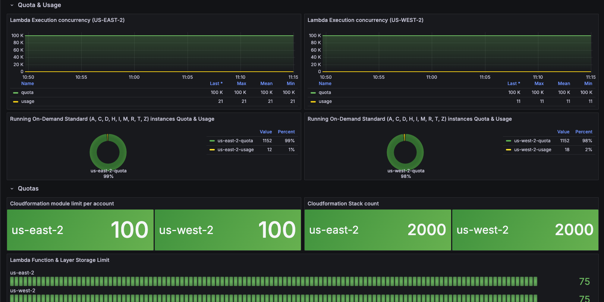

[](https://github.com/emylincon/aws_quota_exporter/releases)
[](https://github.com/emylincon/aws_quota_exporter/actions)
[](https://github.com/emylincon/aws_quota_exporter/blob/main/LICENSE)
[](https://goreportcard.com/report/github.com/emylincon/aws_quota_exporter)
[](https://github.com/pre-commit/pre-commit)
# aws_quota_exporter
Export AWS quotas on Prometheus

# Why?
A subset of the aws service quotas are labelled `adjustable`. This can be at the account or region level. If some of the quotas are adjusted for some regions, then the quotas per region would no longer be homogeneous. This would cause a rift when creating monitoring or alerting logic in prometheus based on the service quotas.

The aim of the `aws_quota_exporter` is to export these quotas in prometheus to solve the above problem. At the time of writing, this feature is not currently available in the [`prometheus yace exporter`](https://github.com/nerdswords/yet-another-cloudwatch-exporter/issues/138)

# Usage
* Run the following command
```
go run . --prom.port=10100 --config.file=config.yml
```
* Example of `config.yml`
```yaml
jobs:
  - serviceCode: lambda
    regions:
      - us-west-1
      - us-east-1
    role: arn:aws:iam::ACCOUNT-ID:role/rolename # optional
  - serviceCode: cloudformation
    regions:
      - us-west-1
      - us-east-1
```
* Use the optional `role` key if you want the exporter to assume the role when retrieving that specific job metrics
## Help
* View program help:
```bash
$ ./aws_quota_exporter -h
```
```
Usage of ./aws_quota_exporter:
  -cache.duration duration
        cache expiry time (seconds). (default 300ns)
  -config.file string
        Path to configuration file. (default "/etc/aqe/config.yml")
  -log.folder string
        Folder to store logfiles. logs to stdout if not specified. (default "stdout")
  -log.format string
        Format of log messages (text or json). (default "text")
  -log.level string
        Log level to log from (DEBUG|INFO|WARN|ERROR). (default "INFO")
  -prom.port int
        port to expose prometheus metrics. (default 10100)
  -version
        Display aqe version
```
## Version
* Display version
```bash
$ ./aws_quota_exporter -version
```
```
aqe version 0.1.2 darwin/arm64
```
## Service Codes
The `serviceCode` is the AWS service identifier. To identify the `serviceCode` for a particular service, use the following aws cli command:
```bash
aws service-quotas list-services
```
## Docker Image Usage
Using the docker image avaliable on [dockerhub](https://hub.docker.com/r/ugwuanyi/aqe)
```bash
docker run --name my-aqe -d -p 10100:10100 -e AWS_ACCESS_KEY=111222 -e AWS_SECRET_KEY=secret ugwuanyi/aqe:main
```
# AWS Authentication
This program relies on the `AWS SDK for Go V2` for handling authentication.
The AWS SDK uses its default credential chain to find AWS credentials. This default credential chain looks for credentials in the following order:

1. **Environment variables**
    1. **Static Credentials:** `(AWS_ACCESS_KEY_ID, AWS_SECRET_ACCESS_KEY, AWS_SESSION_TOKEN)`
    2. **Web Identity Token:** `(AWS_WEB_IDENTITY_TOKEN_FILE)`

2. **Shared configuration files**
    * SDK defaults to `credentials file` and `config file` under `.aws` folder that is placed in the home folder on the host.

3. IAM role for tasks.
4. IAM role for Amazon EC2.

*By default, the SDK checks the `AWS_PROFILE` environment variable to determine which profile to use. If no `AWS_PROFILE` variable is set, the SDK uses the default profile.*

*To set profile to use:*
```bash
$ AWS_PROFILE=test_profile
```

# Helm Chart Usage
Steps to use the helm chart
* Add chart to local repository
```bash
helm repo add aws_quota_exporter https://emylincon.github.io/aws_quota_exporter
```
* To view configurable values. You can edit any of those the configurable values.
```bash
helm show values aws_quota_exporter/aqe
```
* In this example, we will set the aws credentials in values.yaml
```yaml
secret:
  # base64 encoded secrets
  AWS_ACCESS_KEY_ID: QVdTX0FDQ0VTU19LRVlfSUQK
  AWS_SECRET_ACCESS_KEY: QVdTX1NFQ1JFVF9BQ0NFU1NfS0VZCg==
```
* We will create a new namespace and install the chart in the namespace
```bash
kubectl create namespace aqe
helm install -n aqe -f values.test aqe aws_quota_exporter/aqe
```
* View installed chart
```bash
helm list -A
```
* Uinstall chart
```bash
helm uninstall -n aqe aqe
```
## AWS Permission Required
The exporter requires the AWS managed policy `ServiceQuotasReadOnlyAccess`. This also depends on the jobs specified in the `config.yml` file, as all of the permissions are probably not required. The permissions included in `ServiceQuotasReadOnlyAccess` are as follows in policy document:
```json
{
    "Version": "2012-10-17",
    "Statement": [
        {
            "Effect": "Allow",
            "Action": [
                "autoscaling:DescribeAccountLimits",
                "cloudformation:DescribeAccountLimits",
                "cloudwatch:DescribeAlarmsForMetric",
                "cloudwatch:DescribeAlarms",
                "cloudwatch:GetMetricData",
                "cloudwatch:GetMetricStatistics",
                "dynamodb:DescribeLimits",
                "elasticloadbalancing:DescribeAccountLimits",
                "iam:GetAccountSummary",
                "kinesis:DescribeLimits",
                "organizations:DescribeAccount",
                "organizations:DescribeOrganization",
                "organizations:ListAWSServiceAccessForOrganization",
                "rds:DescribeAccountAttributes",
                "route53:GetAccountLimit",
                "tag:GetTagKeys",
                "tag:GetTagValues",
                "servicequotas:GetAssociationForServiceQuotaTemplate",
                "servicequotas:GetAWSDefaultServiceQuota",
                "servicequotas:GetRequestedServiceQuotaChange",
                "servicequotas:GetServiceQuota",
                "servicequotas:GetServiceQuotaIncreaseRequestFromTemplate",
                "servicequotas:ListAWSDefaultServiceQuotas",
                "servicequotas:ListRequestedServiceQuotaChangeHistory",
                "servicequotas:ListRequestedServiceQuotaChangeHistoryByQuota",
                "servicequotas:ListServices",
                "servicequotas:ListServiceQuotas",
                "servicequotas:ListServiceQuotaIncreaseRequestsInTemplate",
                "servicequotas:ListTagsForResource"
            ],
            "Resource": "*"
        }
    ]
}
```
*Please Remove permissions that you would not use*

# Grafana Dashboard
Visualizing Quotas


# Useful resources
* include default [port](https://github.com/prometheus/prometheus/wiki/Default-port-allocations) here when finished
* [Guide on how to write an exporter](https://prometheus.io/docs/instrumenting/writing_exporters/)
* [AWS Service Quota Documentation](https://docs.aws.amazon.com/general/latest/gr/aws_service_limits.html)
    * [list-service-quotas](https://docs.aws.amazon.com/cli/latest/reference/service-quotas/list-service-quotas.html): Lists the `applied quota values` for the specified AWS service. For some quotas, only the default values are available. If the applied quota value is not available for a quota, the quota is not retrieved
    * [list-aws-default-service-quotas](https://docs.aws.amazon.com/cli/latest/reference/service-quotas/list-aws-default-service-quotas.html): Lists the `default values` for the quotas for the specified AWS service. A default value does not reflect any quota increases.

## References
* [yace_exporter](https://github.com/nerdswords/yet-another-cloudwatch-exporter/)
* [basic-exporter](https://github.com/antonputra/tutorials/blob/main/lessons/141/prometheus-nginx-exporter/)
